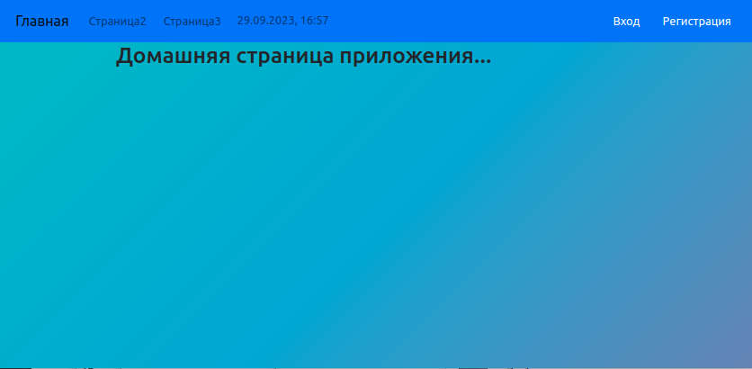
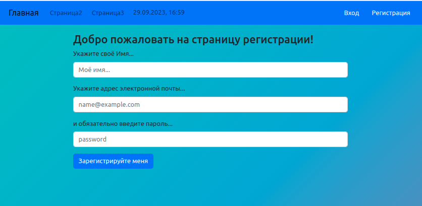
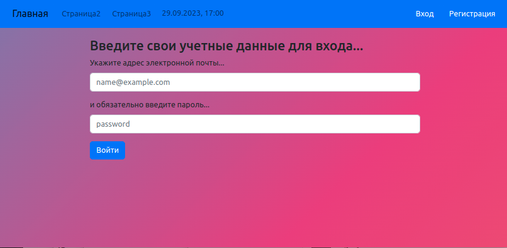
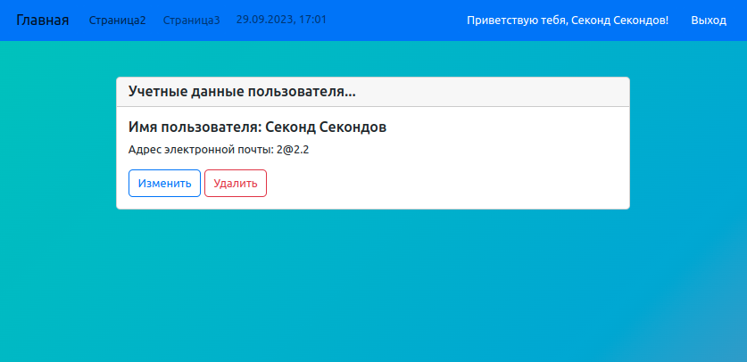
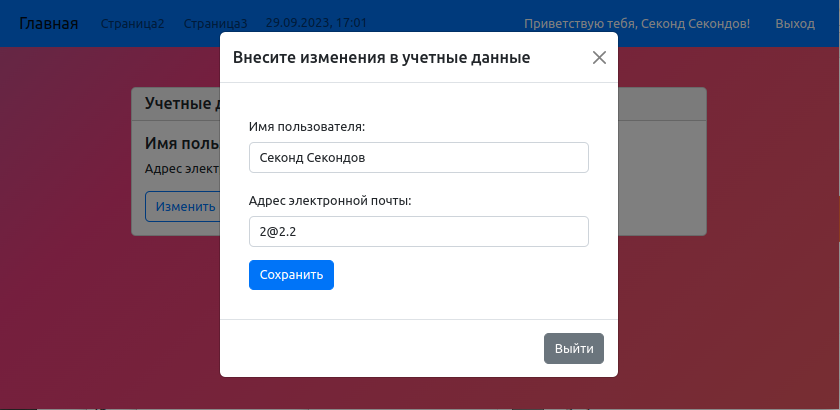

# Пример создания приложения с авторизацией

# Сделай следующее:

1.  Создай новую папку

2.  Скопируй в нее файлы BobyDiV_project_Init.sh и README.md

3.  Открой созданную папку с помощью VSCode

4.  В VSCode открой файл BobyDiV_project_Init.sh

5.  Открой терминал

6.  Выполни инициализацию node

    ### `npm init -y`

7.  Открой package.json и добавь в него скрипты:

    ### "scripts": {

        "start": "node app.js",
        "dev": "nodemon app.js --ignore session --ext js, jsx, json"

    ### },

8.  В фале BobyDiV_project_Init.sh в строке 78 пропиши корректные данные пользователя
    PostgreSQL с правами администратора, согласно примера на строке 84.

    `По умолчанию [admin]=postgres / [password]=postgres / [hostname]=localhost / [PORT]=5432 / [dbName]=db_Name`

9.  Выполни последовательно в терминале следующие команды:

    ### `chmod +x BobyDiV_project_Init.sh`

    ### `./BobyDiV_project_Init.sh`

10. Ответь на вопросы eslint:

    `✔ How would you like to use ESLint? · style`

    `✔ What type of modules does your project use? · esm`

    `✔ Which framework does your project use? · react`

    `✔ Does your project use TypeScript? · No / Yes`

    `✔ Where does your code run? · browser, node`

    `✔ How would you like to define a style for your project? · guide`

    `✔ Which style guide do you want to follow? · airbnb`

    `✔ What format do you want your config file to be in? · JSON`

    `✔ Would you like to install them now? · No / Yes`

    `✔ Which package manager do you want to use? · npm`

11. Запусти приложение командой:

    ### `npm start`

12. Открой в браузере страницу где запущено приложение:
    ### `http://localhost:3000/`

# Если ты видишь в браузере страницу:

### Ты молодец! У тебя все получилось!

### Кликни на регистрацию в шапке страницы

### Добавь себя в пользователи приложения.

### Или зайди в приложение как зарегистрированый пользователь

### Для этого кликни на пункт меню 'Вход'

### Кликни на строку приветствия в меню

### Ты увидишь свои учетные данные

### Можешь внести изменения в них, кликай на кнопку "Изменить"

### Начало положено. Теперь осталось добавить немного функционала, чтобы приложение умело делать что-то еще.

### Желаю удачи. У тебя все получится!

# Just do it!
